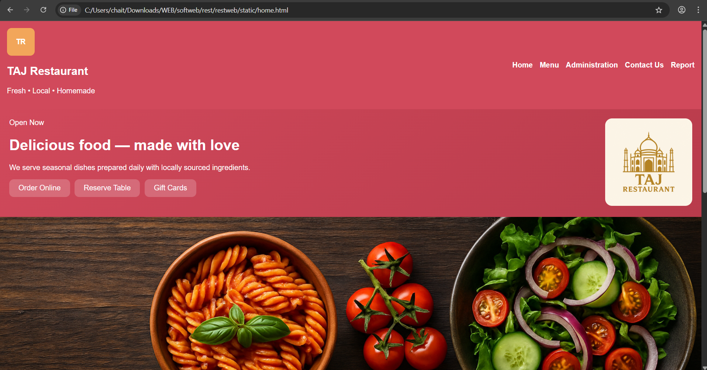
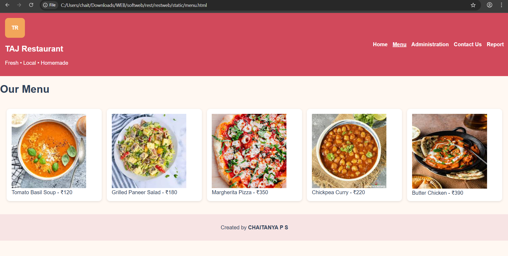
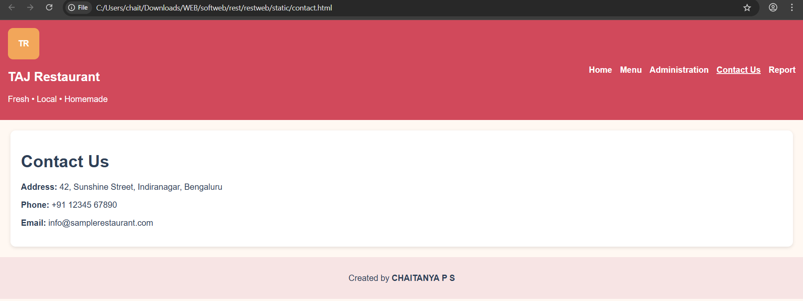

# Ex.07 Restuarant Website
## Date: 15.11.25

## AIM:
To develop a static Resturant website to display the menu and services provided by the resturant.

## DESIGN STEPS:

### Step 1:
Requirement collection.

### Step 2:
Creating the layout using HTML and CSS.

### Step 3:
Updating the sample content.

### Step 4:
Choose the appropriate style and color scheme.

### Step 5:
Validate the layout in various browsers.

### Step 6:
Validate the HTML code.

### Step 7:
Publish the website in the given URL.

## PROGRAM:
home.html
```html
<!doctype html>
<html lang="en">
<head>
  <meta charset="utf-8" />
  <meta name="viewport" content="width=device-width, initial-scale=1" />
  <title>Home - TAJ Restaurant</title>
  <link rel="stylesheet" href="style.css" />
</head>
<body>
  <header class="header">
    <div class="brand">
      <div class="logo">TR</div>
      <div>
        <h2>TAJ Restaurant</h2>
        <p>Fresh • Local • Homemade</p>
      </div>
    </div>
    <nav>
      <ul>
        <li><a href="home.html">Home</a></li>
        <li><a href="menu.html">Menu</a></li>
        <li><a href="administration.html">Administration</a></li>
        <li><a href="contact.html">Contact Us</a></li>
        <li><a href="report.html">Report</a></li>
      </ul>
    </nav>
  </header>

  <section class="banner">
    <div class="hero">
      <span class="eyebrow">Open Now</span>
      <h1>Delicious food — made with love</h1>
      <p>We serve seasonal dishes prepared daily with locally sourced ingredients.</p>
      <div class="quick-links">
        <div class="card">Order Online</div>
        <div class="card">Reserve Table</div>
        <div class="card">Gift Cards</div>
      </div>
    </div>
    <div class="hero-img">
      
    </div>
  </section>
    
  <footer>
    <p>Created by <strong>CHAITANYA P S</strong></p>
  </footer>
</body>
</html>
```
menu.html
```html
<!doctype html>
<html lang="en">
<head>
  <meta charset="utf-8" />
  <meta name="viewport" content="width=device-width, initial-scale=1" />
  <title>Menu - TAJ Restaurant</title>
  <link rel="stylesheet" href="style.css" />
</head>
<body>
  <header class="header">
    <div class="brand">
      <div class="logo">TR</div>
      <div>
        <h2>TAJ Restaurant</h2>
        <p>Fresh • Local • Homemade</p>
      </div>
    </div>
    <nav>
      <ul>
        <li><a href="home.html">Home</a></li>
        <li><a href="menu.html" class="active">Menu</a></li>
        <li><a href="administration.html">Administration</a></li>
        <li><a href="contact.html">Contact Us</a></li>
        <li><a href="report.html">Report</a></li>
      </ul>
    </nav>
  </header>

  <section class="menu-section">
    <h1>Our Menu</h1>
    <div class="menu-grid">
      <div class="food-card"> Tomato Basil Soup - ₹120</div>
      <div class="food-card">Grilled Paneer Salad - ₹180</div>
      <div class="food-card">Margherita Pizza - ₹350</div>
      <div class="food-card">Chickpea Curry - ₹220</div>
      <div class="food-card">Butter Chicken - ₹390</div>
      <div class="food-card">Garlic Naan - ₹60</div>
      <div class="food-card">Masala Dosa - ₹150</div>
      <div class="food-card">Prawn Linguine - ₹420</div>
      <div class="food-card">Chocolate Lava Cake - ₹170</div>
      <div class="food-card">Mango Lassi - ₹120</div>
      <div class="food-card">Herbed Fries - ₹110</div>
      <div class="food-card">Seasonal Veg Platter - ₹260</div>
    </div>
  </section>

  <footer>
    <p>Created by <strong>CHAITANYA P S</strong></p>
  </footer>
</body>
</html>
```
administration.html
```html
<!doctype html>
<html lang="en">
<head>
  <meta charset="utf-8" />
  <meta name="viewport" content="width=device-width, initial-scale=1" />
  <title>Administration - TAJ Restaurant</title>
  <link rel="stylesheet" href="style.css" />
</head>
<body>
  <header class="header">
    <div class="brand">
      <div class="logo">TR</div>
      <div>
        <h2>TAJ Restaurant</h2>
        <p>Fresh • Local • Homemade</p>
      </div>
    </div>
    <nav>
      <ul>
        <li><a href="home.html">Home</a></li>
        <li><a href="menu.html">Menu</a></li>
        <li><a href="administration.html" class="active">Administration</a></li>
        <li><a href="contact.html">Contact Us</a></li>
        <li><a href="report.html">Report</a></li>
      </ul>
    </nav>
  </header>

  <section class="admin-section">
    <h1>Administration Team</h1>
    <div class="admin-grid">
      <div class="admin-card"> Priya Sharma - General Manager</div>
      <div class="admin-card"> Rohan Verma - Head Chef</div>
      <div class="admin-card"> Neha Kapoor - FOH Manager</div>
      <div class="admin-card"> Vikram Singh - Sous Chef</div>
      <div class="admin-card"> Shweta Rao - Operations</div>
      <div class="admin-card"> Arjun Mehta - Marketing</div>
    </div>
  </section>

  <footer>
    <p>Created by <strong>CHAITANYA P S</strong></p>
  </footer>
</body>
</html>
```
contact.html
```html
<!doctype html>
<html lang="en">
<head>
  <meta charset="utf-8" />
  <meta name="viewport" content="width=device-width, initial-scale=1" />
  <title>Contact Us - TAJ Restaurant</title>
  <link rel="stylesheet" href="style.css" />
</head>
<body>
  <header class="header">
    <div class="brand">
      <div class="logo">TR</div>
      <div>
        <h2>TAJ Restaurant</h2>
        <p>Fresh • Local • Homemade</p>
      </div>
    </div>
    <nav>
      <ul>
        <li><a href="home.html">Home</a></li>
        <li><a href="menu.html">Menu</a></li>
        <li><a href="administration.html">Administration</a></li>
        <li><a href="contact.html" class="active">Contact Us</a></li>
        <li><a href="report.html">Report</a></li>
      </ul>
    </nav>
  </header>

  <section class="contact-section">
    <h1>Contact Us</h1>
    <p><strong>Address:</strong> 42, Sunshine Street, Indiranagar, Bengaluru</p>
    <p><strong>Phone:</strong> +91 12345 67890</p>
    <p><strong>Email:</strong> info@samplerestaurant.com</p>
  </section>

  <footer>
    <p>Created by <strong>CHAITANYA P S</strong></p>
  </footer>
</body>
</html>
```
style.css
```css
:root{
  --primary:#D1495B;
  --secondary:#F2A65A;
  --accent:#2E4057;
  --bg:#FFF8F2;
}

body{
  background:var(--bg);
  margin:0;
  font-family:Arial, sans-serif;
  color:var(--accent);
}

.header{
  background:var(--primary);
  padding:15px;
  color:white;
  display:flex;
  justify-content:space-between;
  align-items:center;
}

.logo{
  background:var(--secondary);
  width:60px;
  height:60px;
  display:grid;
  place-items:center;
  font-weight:bold;
  border-radius:10px;
}

nav ul{
  list-style:none;
  display:flex;
  gap:15px;
}
nav a{
  color:white;
  text-decoration:none;
  font-weight:bold;
}
nav a.active{
  text-decoration:underline;
}

.banner{
  display:flex;
  padding:20px;
  background:linear-gradient(135deg,var(--primary),#b83b4b);
  color:white;
}
.banner img{
  width:350px;
  border-radius:15px;
}
.hero{flex:1;}
.quick-links{display:flex;gap:10px;margin-top:15px;}
.card{
  background:rgba(255,255,255,0.2);
  padding:10px 20px;
  border-radius:10px;
}

.menu-grid{
  display:grid;
  grid-template-columns:repeat(auto-fit,minmax(200px,1fr));
  gap:15px;
  padding:20px;
}
.food-card{
  background:white;
  padding:15px;
  border-radius:10px;
  box-shadow:0 2px 6px rgba(0,0,0,0.1);
}

.admin-grid{
  display:grid;
  grid-template-columns:repeat(auto-fit,minmax(220px,1fr));
  gap:20px;
  padding:20px;
}
.admin-card{
  background:white;
  padding:15px;
  border-radius:10px;
  box-shadow:0 2px 6px rgba(0,0,0,0.1);
}
.admin-card img{
  width:80px;
  height:80px;
  border-radius:10px;
  display:block;
  margin-bottom:10px;
}

.contact-section{
  padding:20px;
  background:white;
  margin:20px;
  border-radius:10px;
  box-shadow:0 2px 6px rgba(0,0,0,0.1);
}

footer{
  text-align:center;
  padding:15px;
  background:#f7e4e4;
  margin-top:20px;
}
```

## OUTPUT:




## RESULT:
The program for designing software company website using HTML and CSS is completed successfully.
